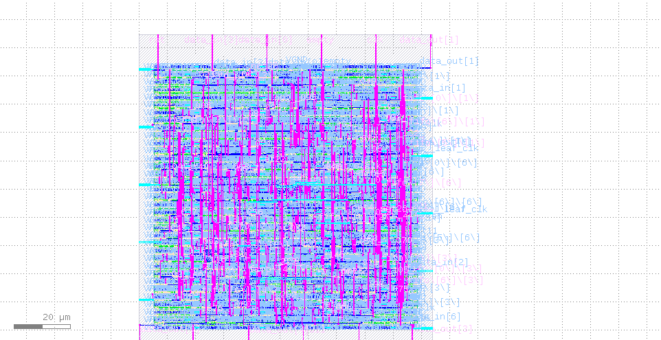

# Parametric Synchronous FIFO: RTL-to-GDSII ASIC Flow
---

This repository contains the RTL design and physical implementation (RTL-to-GDSII) of a parametric **Synchronous FIFO**. The digital design was coded in Verilog and fully hardened using the **OpenLane v1** open-source automated flow targeted at the **SkyWater 130nm (Sky130A)** PDK.

## 1. RTL Architecture & Design

The synchronous FIFO was designed following clean hardware description guidelines to ensure strict compliance with synthesis and Verilator linting checks.

### Key Features:
* **MSB Pointer Bit Control:** Implements an additional MSB bit on both the write (`wr_ptr`) and read (`rd_ptr`) pointers. This architecture provides robust, glitch-free detection of **Full** and **Empty** conditions without addressing ambiguities.
* **Fully Parametric:** Supports runtime adjustments of memory depth (`size`) and word length (`data_width`) using standard Verilog parameters.
* **Synchronous Interface:** All control and memory transactions are evaluated on the rising edge of the clock (`clk`), featuring an asynchronous active-high reset (`rst`).

---

## 2. GDSII Physical Layout

Through the OpenLane flow, the logic gates were mapped into SkyWater standard cells, placed, and fully routed. The final geometric layout can be inspected using KLayout:

<p align="center">
  
  <br>
  <em>GDSII physical layout snapshot showcasing cell placement and metal routing grid (20 µm scale bar).</em>
</p>

---

## 3. Signoff Metrics & Reports

The automated ASIC flow finished with a clean execution status (**[SUCCESS]: Flow complete**), matching all physical and timing signoff constraints.

### Static Timing Analysis (STA)
* **Target Clock Period:** 10.0 ns (100 MHz target frequency)
* **Setup/Hold Violations:** 0 (Positive slack achieved across all critical paths).
* *Detailed log file:* `reports/31-rcx_sta.checks.rpt`

### Physical Verification (DRC & LVS)
* **DRC (Design Rule Checking):** 0 errors. The geometric layout matches all SkyWater 130nm manufacturing tolerances.
* *Detailed log file:* `reports/drc.rpt`
* **LVS (Layout Versus Schematic):** Passed. The circuit netlist net-by-net extraction matches the synthesized Verilog code perfectly.
* *Detailed log file:* `reports/31-sync_fifo.lvs.rpt`
---

## 4. Repository Structure

```text
├── config.json             # OpenLane V1 configuration file
├── layout_overview.png     # Chip layout preview for documentation
├── src/
│   └── fifo.v              # Clean RTL Verilog source code
├── hardware_results/
│   ├── sync_fifo.gds       # Final GDSII layout (manufacturing-ready)
│   └── netlist_sync_fifo.v # Synthesized gate-level netlist
└── reports/
    ├── 31-rcx_sta.checks.rpt  # Static Timing Analysis report
    ├── drc.rpt                # Design Rule Checking (DRC) report
    └── 31-sync_fifo.lvs.rpt   # Layout Versus Schematic (LVS) report
